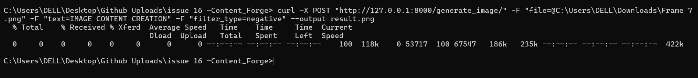
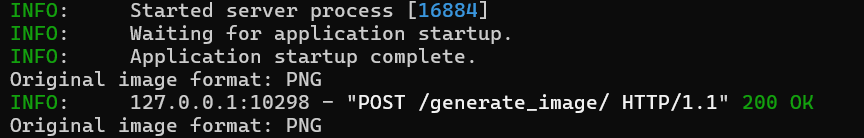

# Issue 12: Image Content Creation Microservice

## Description
This microservice generates detailed images with random patterns, shapes, text, and filters using Python's PIL library.Along with integration of FastAPI is used to build a microservice endpoint that allows clients to request and receive generated images.

## Dependencies
- Python (version 3.x)
- PIL (Python Imaging Library)
- FastAPI
- Uvicorn (ASGI server)


## How to Run
1. **Clone the repository and install dependencies:**
 ```bash
   git clone <repository-url>
   cd <repository-folder>
   pip install pillow fastapi uvicorn
 ```

2. **how to run the service**

 a. (in one window)

 ```bash
   uvicorn main:app --reload 
 ``` 
 b. open another cmd window while letting the above  on run and type:
 
 ```bash
   curl -X POST "http://127.0.0.1:8000/generate_image/" -F "file=@<your image path>" -F "text=<desired text you want to print as a header on the image" -F "filter_type=you can use filters like 'black_and_white' or 'negative' " --output <name_of_output_image_you_want_to_keep>.png
 ```
for eg:

 ```bash
 curl -X POST "http://127.0.0.1:8000/generate_image/" -F "file=@C:\Users\DELL\Downloads\IMG_20240206_033517.jpg" -F "text=Hi!" -F "filter_type=blur" --output result.png

 ```

## Screenshots:

#### Sample Image (Input)
<br>


<br>
<br>

#### result_image (Output)
<br>


#### Service
<br>



<br>




